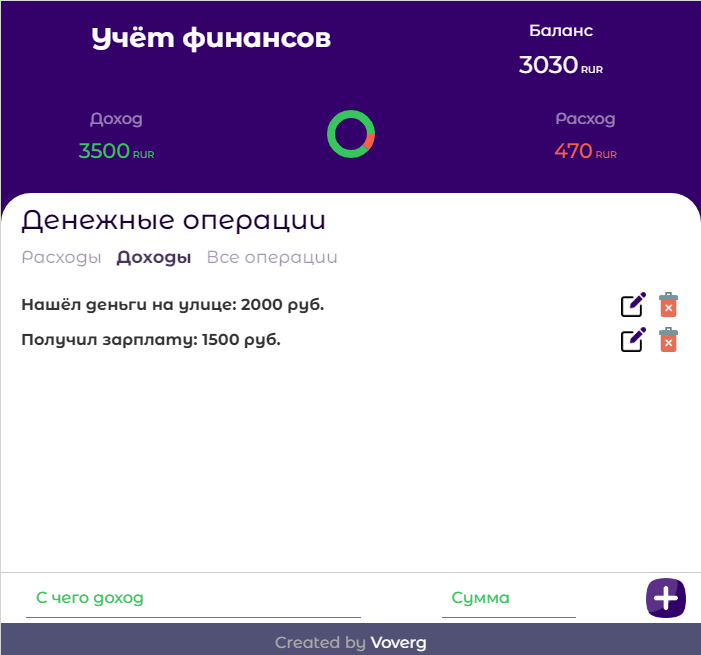
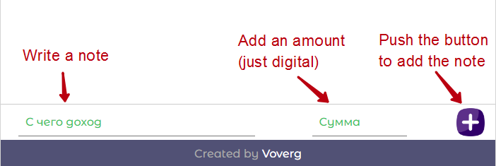
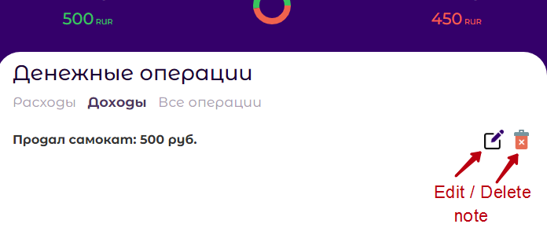
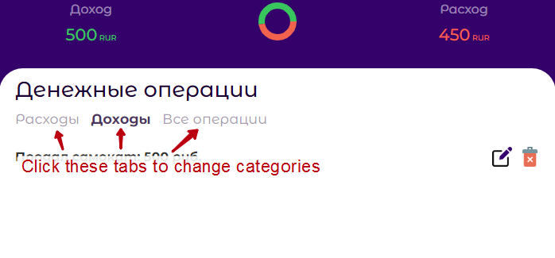

# <a name='nav'>Budget application</a>

- [App description](#description)

---

## <a name='description'>Description</a>

This is a simple application written by html, css and clean javascript. You can see this app demo version on GitHub Pages [this link](https://voverg.github.io/50-simple-projects/budget/ 'Look budget demo')

This application allows you to keep records of personal finances. It's easy, just try it!

Start write a text note in your income or expense tab in the first input field and then write an amount (just digit) in the second field. Push the 'Plus' button (or **Enter** key on your keyboard)  to add a note to the note list.

if you want to delete or edit any note, you should push the **edit** or **delete** icon buttons.

Click the tab buttons to change categories of money operations.

