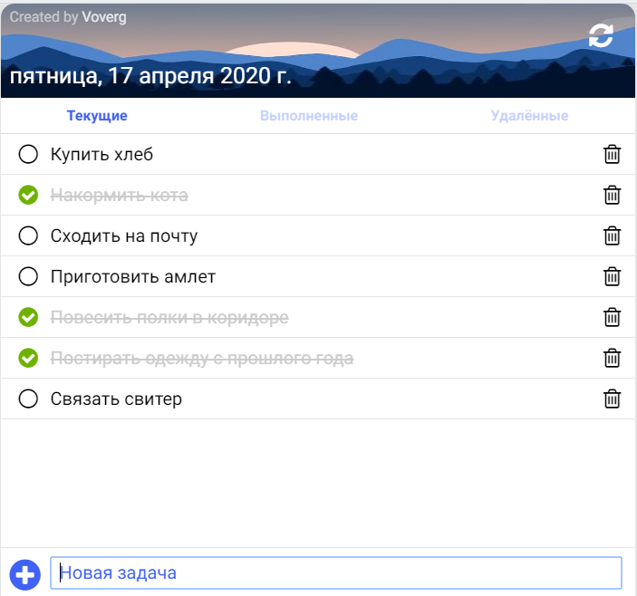
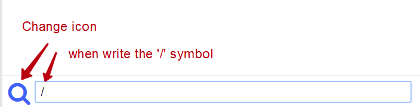
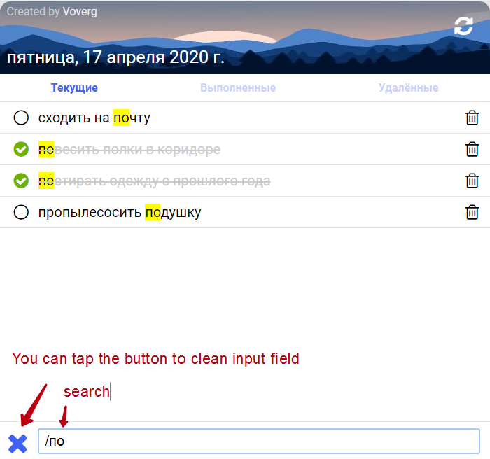
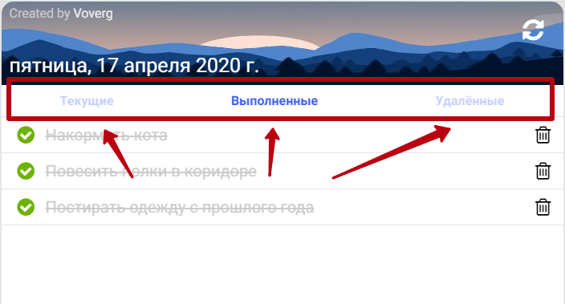
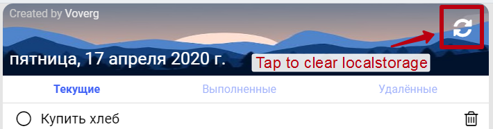

# <a name='nav'>ToDo application</a>

- [App description](#description)
- [Quick start development](#quickstart)
- [How to use this project](#howto)

---

## <a name='description'>Description</a>

This is a simple application written by html, css and clean javascript. In order to see a demo version of this app go to Github Pages [this link](https://voverg.github.io/50-simple-projects/good-todo/ 'Look task manager demo')

Start write a text in input field and then push the **Enter** on your keyboard or 'Plus' button in bottom left corner next to the input field to add a task to the task list. You can edit any task by clicking to it and push 
the "Enter" button on your keyboard to apply changes.

This ES6 standard project rebuild with webpack and babel to be cross browsers.

if you want to use search by tasks, you should writ a **/** symbol in **input** field

and then start to write a task that you want to find

Also you can use task filters such as **current tasks**, **done tasks** or **deleted tasks**

If you want to remove all your tasks from local storage, push the button in the header in the right top corner.

-----

[Return to navigation](#nav)
