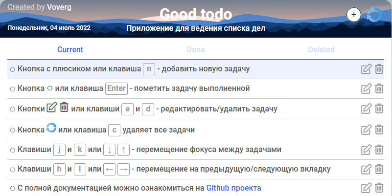
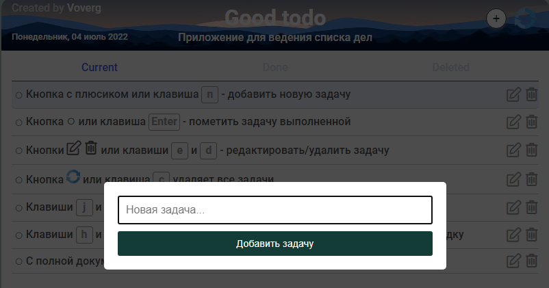

# <a name='nav'>Good todo</a>

Это простое приложение для ведения списка дел, написанное на HTML, CSS и чистом JavaScript. Посмотреть демо-версию можно на [GitHub Pages по этой ссылке](https://voverg.github.io/js-apps/good-todo 'Посмотреть демо-версию')

- [Описание](#description)
- [Горячие клавиши](#hotkeys)
- [Description(eng)](#description_eng)
- [Hotkeys(eng)](#hotkeys_eng)

---

## <a name='description'>Описание</a>
Приложение "Good todo":
- Добавляйте новые задачи
- Для добавления ссылки в задачу используйте конструкцию *\[Название ссылки\]\(сама ссылка\)*
- Удаляйте задачи, как по одной (поместятся на вкладку 'Deleted'), так и все сразу (полностью удалятся из приложения)
- Редактируйте задачи
- Помечайте задачи выполненными. Выполненные задачи отображаются на вкладке 'Done'.
- Управляйте задачами с помощью горячих клавиш

Чтобы добавить задачу во всплывающем окне нажмите на кнопку "Добавить задачу" или клавишу `Enter`

Чтобы отменить добавление новой задачи или редактирование, кликните на затемнённую область или нажмите клавишу `Escape`

[Назад к заглавию](#nav)

## <a name='hotkeys'>Горячие клавиши</a>
- `n` - добавление новой задачи вo вкладку Current 
- Клик по задаче выделяет её
- `e` - редактирование выделенной задачи
- `Enter` - пометить выделенную задачу выполненной
- `d` - удалить выделенную задачу
- `c` - удалить все задачи
- `j` или стрелка вниз - переместиться по задачам вниз
- `k` или стрелка вверх - переместиться по задачам вверх
- `h` или стрелка влево - переместиться на предыдущую вкладку
- `l` или стрелка вправо - переместиться на следуюдую вкладку
В мобильной версии можно просто свайпать влево/вправо, чтобы переключаться между вкладками.

[Назад к заглавию](#nav)

## <a name='description_eng'>App description</a>
This is a simple task manager application written by html, css and pure javascript. You can see this app demo version on [GitHub Pages this link](https://voverg.github.io/js-apps/good-todo 'Look good-todo demo')

Habits tracker app:
- Add new tasks to the Current tab
- To add a link in your task use this construction *\[Link title\]\(link\)*
- Remove one (move to the Deleted tab) or all tasks (delete from application)
- Edit tasks
- Get tasks done. All done tasks move to the Done tab
- Manage tasks with hotkeys

[Back to menu](#nav)

## <a name='hotkeys_eng'>Hot keys</a>
- `n` - add a new task to the Current tab
- Click a task to select it
- `e` - edit the selected task
- `Enter` - done the selected task
- `d` - remove the selected task
- `c` - remove all tasks
- `j` or Arrow Down - move on tasks down
- `k` or Arrow Up - move on tasks up
- `h` or Arrow Left - go to the next tab
- `l` or Arrow Right - go to the prev tab
In mobile version you can left/right swipe to change between tabs.

[Back to menu](#nav)

