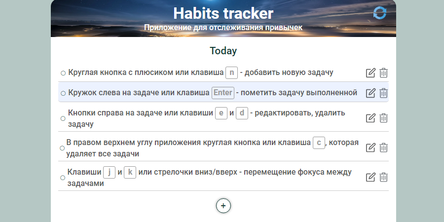
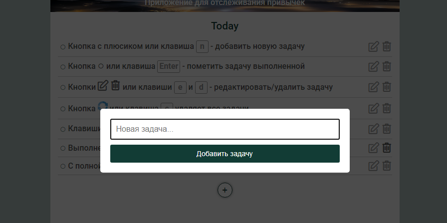

# <a name='nav'>Habits tracker</a>

Это простое приложение, написанное на HTML, CSS и чистом JavaScript. Приложение поможет не забыть выполнить ежедневные задачи, которые вы хотите, чтобы переросли в привычки. Вы можете посмотреть демо-версию приложения на [GitHub Pages по этой ссылке](https://voverg.github.io/50-simple-projects/habits 'Посмотреть демо-версию')

- [Описание](#description)
- [Горячие клавиши](#hotkeys)
- [Description(eng)](#description_eng)
- [Hotkeys(eng)](#hotkeys_eng)

---

## <a name='description'>Описание</a>
Приложение "Трекер привычек":
- Добавляйте новые задачи на текущий день (блок Today)
- Для добавления ссылки в задачу используйте конструкцию *\[Название ссылки\]\(сама ссылка\)*
- Удаляйте задачи, как по одной, так и все сразу
- Редактируйте задачи
- Помечайте задачи выполненными. Выполненные задачи переместятся на следующий день (блок Tomorrow).
- При наступлении нового дня все задачи перемещаются в блок Today
- Управляйте задачами с помощью горячих клавиш

Чтобы добавить задачу во всплывающем окне нажмите на кнопку "Добавить задачу" или клавишу `Enter`

Чтобы отменить добавление новой задачи или редактирование, кликните на затемнённую область или нажмите клавишу `Escape`

[Назад к заглавию](#nav)

## <a name='hotkeys'>Горячие клавиши</a>
- `n` - добавление новой задачи в блок Today
- Клик по задаче выделяет её
- `e` - редактирование выделенной задачи
- `Enter` - пометить выделенную задачу выполненной
- `d` - удалить выделенную задачу
- `c` - удалить все задачи
- `j` или стрелка вниз - переместиться по задачам вниз
- `k` или стрелка вверх - переместиться по задачам вверх

[Назад к заглавию](#nav)

## <a name='description_eng'>App description</a>
This is a simple habit tracker application written by html, css and clean javascript. You can see this app demo version on [GitHub Pages this link](https://voverg.github.io/50-simple-projects/habits 'Look habits tracker demo')

Habits tracker app:
- Add new tasks to the current day (block Today)
- To add a link in your task use this construction *\[Link title\]\(link\)*
- Remove one or all tasks
- Edit tasks
- Get tasks done. All done tasks move to the block Tomorrow
- Tomorrow all tasks move to the block Today
- Manage tasks with hotkeys

[Back to menu](#nav)

## <a name='hotkeys_eng'>Hot keys</a>
- `n` - add a new task to the block Today
- Click a task to select it
- `e` - edit the selected task
- `Enter` - done the selected task
- `d` - remove the selected task
- `c` - remove all tasks
- `j` or Arrow Down - move on tasks down
- `k` or Arrow Up - move on tasks up

[Back to menu](#nav)

