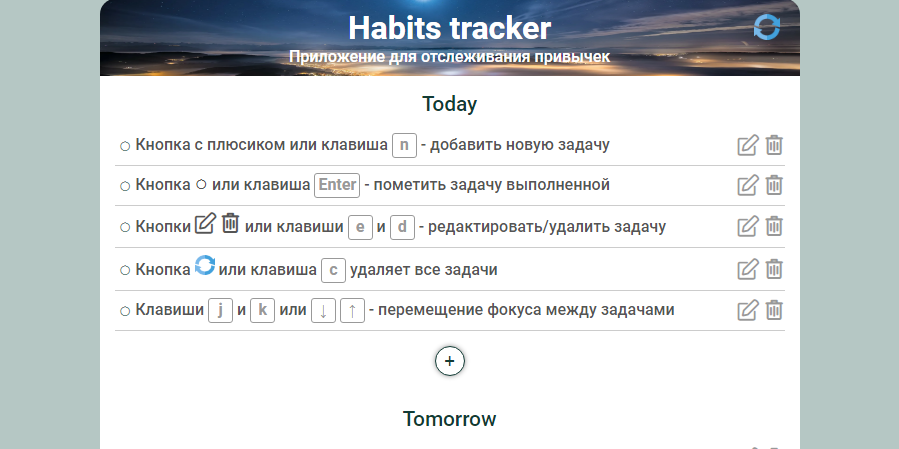

# <a name='nav'>Habits tracker</a>

Это простое приложение, написанное на HTML, CSS и чистом JavaScript. Приложение поможет не забыть выполнить ежедневные задачи, которые вы хотите, чтобы переросли в привычки. Вы можете посмотреть демо-версию приложения на [GitHub Pages по этой ссылке](https://voverg.github.io/50-simple-projects/habits 'Посмотреть демо-версию')

- [Описание](#description)
- [Горячие клавиши](#hotkeys)
- [Description(eng)](#description_eng)
- [Hotkeys(eng)](#hotkeys_eng)

---

## <a name='description'>Описание</a>
Приложение "Трекер привычек":
1. Добавляйте новые задачи на текущий день (блок Today)
3. Удаляйте задачи, как по одной, так и все сразу
2. Редактируйте задачи
3. Помечайте задачи выполненными. Выполненные задачи переместятся на следующий день (блок Tomorrow).
4. При наступлении нового дня все задачи перемещаются в блок Today
5. Управляйте задачами с помощью горячих клавиш

## <a name='nav'>Назад к заглавию</a>

## <a name='hotkeys'>Горячие клавиши</a>
- `n` - добавление новой задачи в блок Today
- Клик по задаче выделяет её
- `e` - редактирование выделенной задачи
- `Enter` - пометить выделенную задачу выполненной
- `d` - удалить выделенную задачу
- `c` - удалить все задачи
- `j` или стрелка вниз - переместиться по задачам вниз
- `k` или стрелка вверх - переместиться по задачам вверх
## <a name='nav'>Назад к заглавию</a>

## <a name='description_eng'>Description</a>
This is a simple habit tracker application written by html, css and clean javascript. You can see this app demo version on [GitHub Pages this link](https://voverg.github.io/50-simple-projects/habits 'Look habits tracker demo')
## <a name='nav'>Back to menu</a>

## <a name='hotkeys_eng'>Hot keys</a>
This is a simple habit tracker application written by html, css and clean javascript. You can see this app demo version on [GitHub Pages this link](https://voverg.github.io/50-simple-projects/habits 'Look habits tracker demo')
## <a name='nav'>Back to menu</a>

