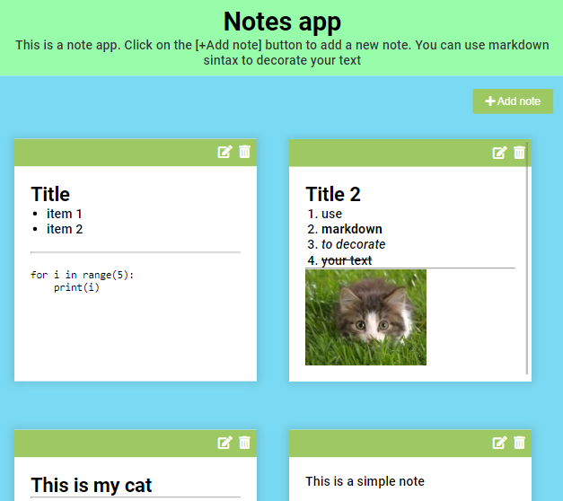

# Notes

## Description

This is a simple notes application written by HTML, CSS and pure JavaScript. You can see this app demo version on Github Pages by [this link](https://voverg.github.io/js-apps/notes-app)

In this app you can add, edit and delete note cards. You can use markdown sintax to decorate your text. All of your notes will keep in your browser (localstorage).

