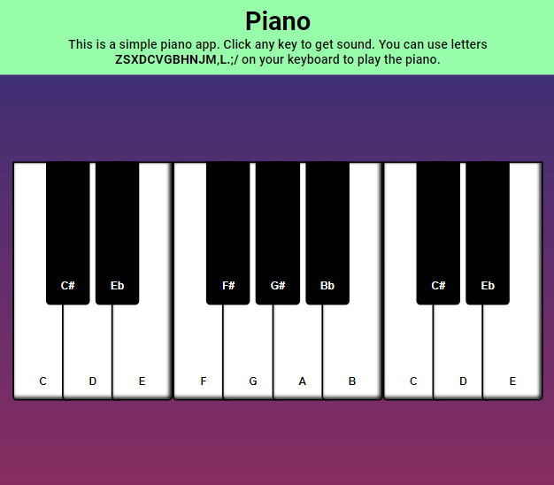

# Piano

## Description

This is a simple piano application written by HTML, CSS and pure JavaScript. You can see this app demo version on Github Pages by [this link](https://voverg.github.io/js-apps/piano)

In this app you can play the piano by clicking piano keys with a mouse cursor on the screen or press **awsedftgyhujkolp;** keys on your keyboard.

