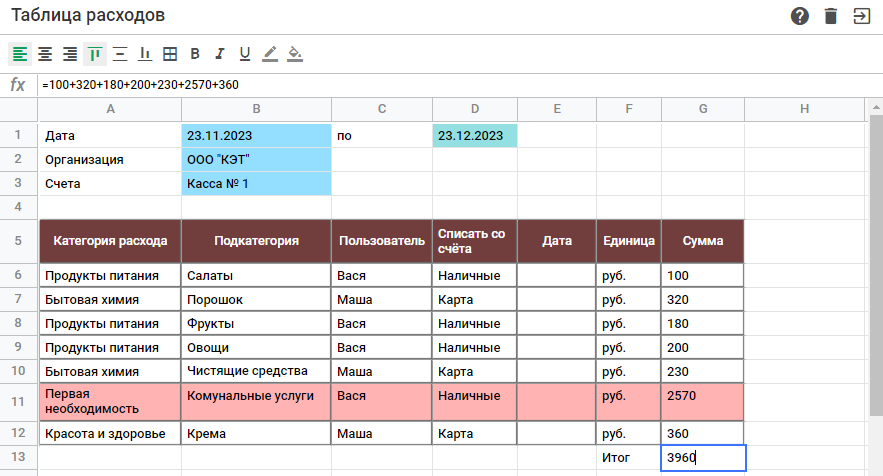

# <a name='nav'>Sheets</a>

Это приложение, написанное на HTML, CSS и чистом JavaScript. Вы можете посмотреть демо-версию приложения на [GitHub Pages по этой ссылке](https://voverg.github.io/js-apps/sheets 'Посмотреть демо-версию')

- [Описание](#description)
- [Description(eng)](#description_eng)

---

## <a name='description'>Описание</a>
Приложение "Таблицы":
-
-
-

[Назад к заглавию](#nav)
