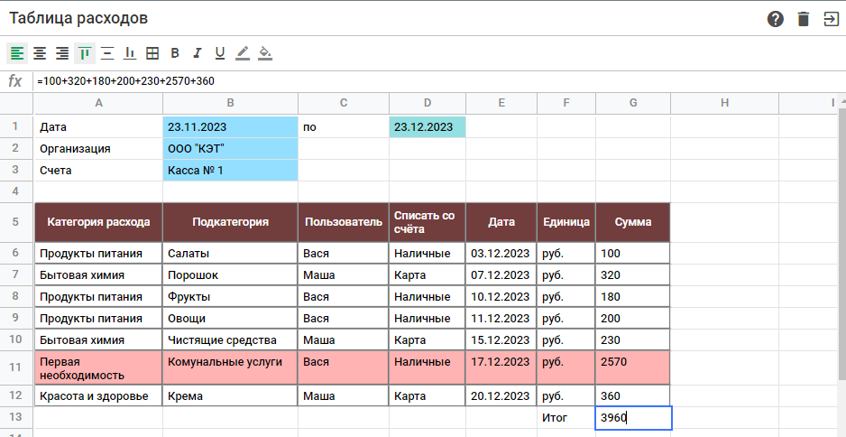

# <a name='nav'>Sheets</a>

Это приложение, написанное на HTML, CSS и чистом JavaScript. Вы можете посмотреть демо-версию приложения на [GitHub Pages по этой ссылке](https://voverg.github.io/js-apps/sheets 'Посмотреть демо-версию')

- [Описание](#description)

---

## <a name='description'>Описание</a>
В приложении можно:
- Создавать любое кол-во таблиц, редактировать и удалять их.
- В таблице можно изменять размер строк и столбцов
- Можно стилизовать ячейки как по одной, так и группы ячеек.
- В версии для ПК можно осуществлять навигацию между ячейками с помощью стрелок на клавиатуре
- Есть возможность в ячейках выполнять простые математические операции
- В приложении есть раздел "Помощь", в котором более подробно описаны все возможности.

В приложении реализован фреймворк, который позволяет:
- Отрисовывать компоненты приложения.
- Упростить обработку событий.
- Работать как с внутренним состоянием компонентов, так и с глобальным стором всего приложения.
- Создавать любое кол-во страничек и осуществлять их роутинг.
- Возможность лекго расширять приложение новыми компонентами.

[Назад к заглавию](#nav)
