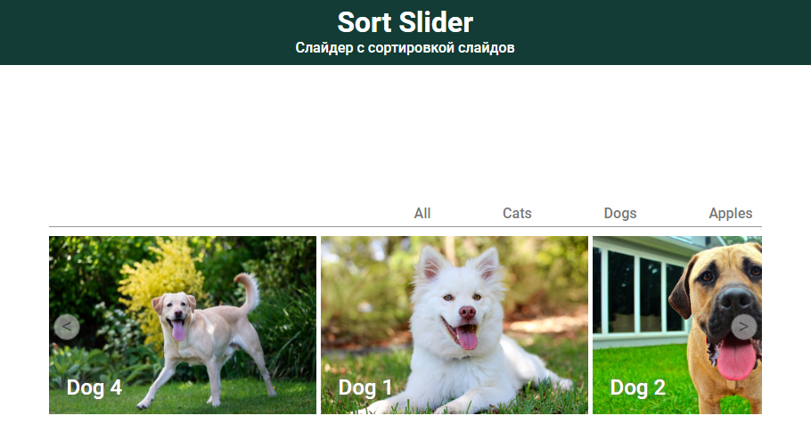

# <a name='nav'>Sort slider</a>

Это простое приложение, написанное на HTML, CSS и чистом JavaScript. Вы можете посмотреть демо-версию приложения на [GitHub Pages по этой ссылке](https://voverg.github.io/js-apps/sort-slider/ 'Посмотреть демо-версию')

- [Описание](#description)
- [Description(eng)](#description_eng)

---

## <a name='description'>Описание</a>
Приложение "Слайдер с сортировкой":
- Нажимайте на кнопки-стрелочки слева и справа, чтобы листать слайдер
- Вверху слайдера расположено меню, нажав на пункты которого, можно отсортировать картинки слайдера по категориям

[Назад к заглавию](#nav)

## <a name='description_eng'>App description</a>
This is a simple application written by html, css and clean javascript. You can see this app demo version on [GitHub Pages this link](https://voverg.github.io/js-apps/sort-slider/ 'Look at demo')

Sort slider app:
- Click on the arrow buttons on the left and right to flip slider
- At the top of the slider there is a menu by clicking on the items of which, you can sort the pictures by category

[Back to menu](#nav)
